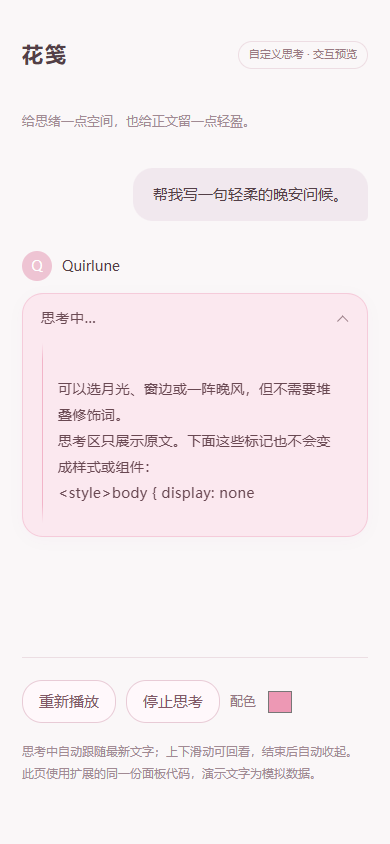

# 花笺 · 自定义思考

为 **TauriTavern 2.2.0** 制作的前端扩展。把模型输出中 `<think>…</think>` 包裹的内容拆成独立的思考面板。

- 思考时逐渐展开，最多占用设定高度；新内容自动滚动，上下边缘渐隐。
- 思考结束自动收起，点击可以再次展开；展开、收起和高度变化带有动画。
- 原文通过 `textContent` 显示，CSS、XML、HTML、Markdown 都作为普通文字。
- 默认柔粉色，可修改面板颜色、文字颜色、字号和最大高度。
- 起止标记可自定义，按原文匹配；没有灯泡，也不生成标题摘要。
- 思考正文独立保存，保留回看能力，不加入酒馆的后续聊天上下文。

## 安卓安装

1. 打开 TauriTavern 的 **扩展 → 安装扩展**。
2. 粘贴这个地址并安装：

   ```text
   https://github.com/Quirlune/tauritavern-cute-cot
   ```

3. 重新加载 TauriTavern，在扩展设置中打开 **花笺 · 自定义思考**。
4. 默认识别 `<think>` 和 `</think>`；修改后点击 **保存设置**。标记的修改从下一次生成开始生效，颜色会立即更新已显示的面板。

模型需要实际输出这组标签，例如：

```text
<think>这里是模型提供的思考文字。</think>
这里是正常回答。
```

开启酒馆的流式输出，就能看到边思考边滚动的效果。非流式输出也能分离内容，到达时直接显示折叠面板。

更新：在扩展管理里更新本扩展并重新加载。卸载或停用后重新加载即可停止扩展；已经分离的思考记录仍在本地聊天文件中，重新安装后可以回看。

## 交互预览

下载仓库里的 [preview.html](preview.html)，用浏览器打开即可播放模拟流式效果、点击展开或修改配色。预览使用与扩展相同的面板代码，无需连接模型。



## 内容与上下文

普通回答保存在 `message.mes`；思考原文保存在 `message.extra.cute_cot`，随当前候选回复一起保存。扩展本身不发起网络请求。

正常流式生成会在酒馆的 `cleanUpMessage`、正文正则、Markdown 格式化之前拆分标签。非流式输出和手动编辑通过消息事件在正文渲染前拆分。历史生成拦截器移除生成副本里的思考存档，Chat Completion 的提示词完成事件进一步过滤助手消息中的标签块；本地存档不因此删除。

“不进入历史上下文”指酒馆标准生成流程，不等于不保存聊天文件。主动读取 `extra` 并自行组装网络请求的其他扩展需要遵守相同约定。

标记区分大小写、不是正则表达式；出现多组标记时合并展示。起止标记属于保留分隔符，即使写在代码块中也会被识别。收到开始标记后若没有结束标记，余下内容会留在思考区；停止或生成结束后折叠为“思考已停止”，不会把未闭合思考当成正文。

本扩展针对**回答正文中的自定义标签**。服务商独立返回的 `reasoning_content` 等原生思考字段仍由酒馆原有功能处理。扩展不额外请求或强制模型生成思考。

## 兼容与验证

适配基准是 [TauriTavern v2.2.0](https://github.com/Darkatse/TauriTavern/tree/v2.2.0)，提交 `2b4de4b8a8aab467d9e75d546be84754918cc026`。没有修改或重新打包 APK。

这一版本没有通用的可修改流式输出事件，因此扩展使用 `STREAM_TOKEN_RECEIVED` 接入当前 `StreamingProcessor.onProgressStreaming`，并装饰 `ReasoningHandler.updateDom`。这两处属于版本相关的实现接口；升级酒馆或同时使用接管相同方法的扩展后，应重新验证兼容性。

聊天 DOM 重建沿用原有 reasoning 生命周期；不创建扫描完整聊天的 observer，也不注册第二套虚拟列表。

已完成：

- Node 自动化测试：流式标记拆分、多个思考块、特殊字符、20 万字符思考、非流式、编辑、停止/错误、重新生成、续写、候选回复隔离、历史过滤。
- 用 **2.2.0 原始 `StreamingProcessor` 和 `ReasoningHandler` 类**运行的浏览器测试：思考不进入原生正文清理/渲染函数，纯文本无子元素，390px 手机宽度无横向溢出，180px 高度上限，自动滚到底部，收起/展开动画，脱离 DOM 后重新挂载。
- 未连接真实模型，也未在 Android 实机 WebView 上测试；浏览器验证使用桌面 Chrome 的手机视口。

## 开发

安装不需要 Node.js 或构建工具。源码直接从扩展根目录加载。

```sh
npm test
node scripts/build-preview.mjs
```

浏览器回归测试脚本和运行方式见 [TESTING.md](TESTING.md)。

`parser.js` 负责纯文本分离；`integration.js` 负责酒馆接入；`panel.js` 与 `style.css` 负责显示；`index.js` 负责扩展入口和设置。

MIT License。
